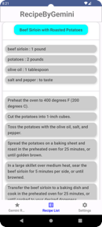

# RecipeByGemini Application
## Introduce app
This app uses the Gemini API to display a list of ingredients and recipes for foods that can be made by entering the ingredients you have. You can also save recipes you receive in this way to the app.

    

## Purpose
Created an app with the purpose of to find recipes easily for food that can be made with the ingredients you have.

## Specific SDK / Library / function list
- Google Gemini API
- Jetpack Compose
- Dagger-Hilt
- Retrofit
- Kotlin Coroutines
- Room
- OKHttp
- MVVM architecture
